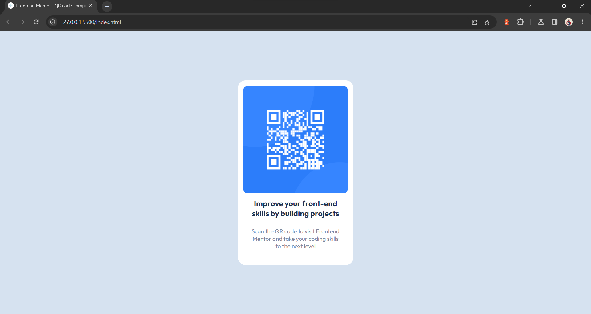

# Frontend Mentor - QR code component solution

This is a solution to the [QR code component challenge on Frontend Mentor](https://www.frontendmentor.io/challenges/qr-code-component-iux_sIO_H). Frontend Mentor challenges help you improve your coding skills by building realistic projects. 

## Table of contents

- [Overview](#overview)
  - [Screenshot](#screenshot)
  - [Links](#links)
- [My process](#my-process)
  - [Built with](#built-with)
  - [What I learned](#what-i-learned)
  - [Continued development](#continued-development)
  - [Useful resources](#useful-resources)
- [Author](#author)

## Overview

### Screenshot



### Links

- Live Site URL: [Live site](https://jonas4899.github.io/QR_code_component/)

## My process

### Built with

- HTML5 markup
- CSS custom properties
- Flexbox

### What I learned

One of the most useful tricks used in this project was to define the font size as shown bellow: 

```css
html {
  font-size: 62.5%;
}
```

This allows us to define the font size in 10px. With this change, it's easier to use relative units as "rem". For instance, I want to define a 25px height of a div. Then you should write something like:

```css
div {
  height: 2.5rem;
}
```

### Continued development

In future projects I want to focus on making better layouts with CSS flexbox and CSS grid. Also, use good practices to code for better understanding.

### Useful resources

- [A complete Guide to Flexbox](https://css-tricks.com/snippets/css/a-guide-to-flexbox/) - In this guide you have all properties that you need when using Flexbox.

## Author

- Frontend Mentor - [@Jonas4899](https://www.frontendmentor.io/profile/Jonas4899)
